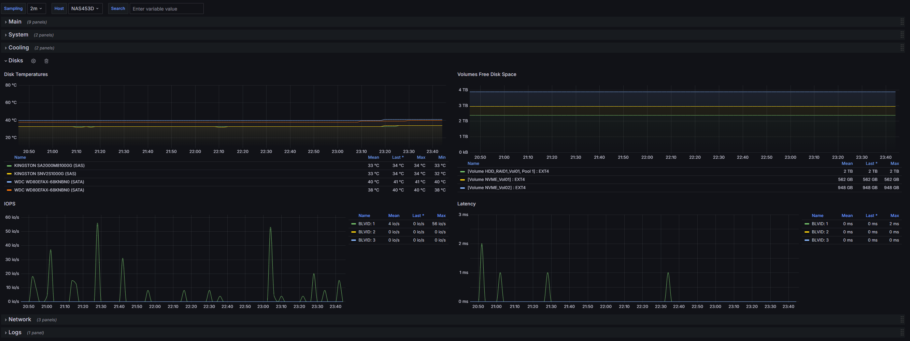

# QNAP exporter

## Description
This repository provides a metrics exporter for Qnap NAS. It uses Telegraf with SNMP input and Prometheus output. Grafana Dashboard is included as k8's ConfigMap.

## How to configure NAS

* Open Control Panel and locate the SNMP section
* Enable SNMP with options:
    * Port: 161
    * SNMP Version: SNMP V1/V2
    * Community: snmp-telegraf

## Grafana dashboard overview

### Main

### System

### Cooling

### Disks

### Network

### Logs
This section queries Loki for syslog logs. Logs should be sent in a separate process.


## Helm Chart Configuration
Most important Helm configuration properties.

| Property                              | Description                          | Example                  |
| --------------------------------------| ------------------------------------ | ------------------------ |
| nas.hostname                          | Hostname of you NAS                  | NAS453D                  |
| nas.snmp.agent                        | URL for SNMP agent                   | udp://192.168.1.100:161  |
| nas.snmp.timeout                      | SNMP timeout                         | 110s                     |
| nas.snmp.version                      | SNMP version                         | 2                        |
| nas.snmp.community                    | SNMP community name                  | snmp-telegraf            |
| nas.snmp.retries                      | Number of retries                    | 0                        |
| metrics.enabled                       | Enable metrics scraping              | true                     |
| metrics.serviceMonitor.labels.release | Release name for Prometheus operator | kube-monitoring          |


## Helm install

```shell
 helm pull oci://ghcr.io/bsosnowski/charts/qnap-exporter --version 0.0.1
```

## TODO
- [ ] add support for Syslog -> Loki
- [ ] add support for Prometheus rules